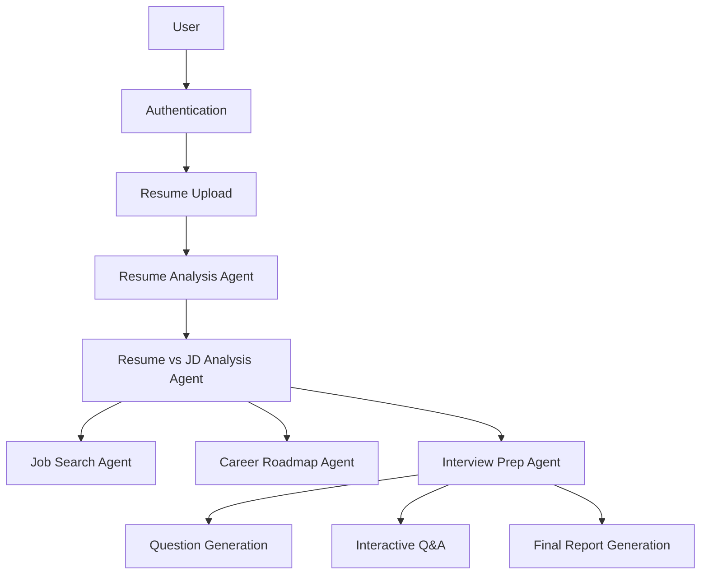

# 🚀 PrepMate AI Backend

<div align="center">
  <p><strong>An AI-powered interview copilot & career preparation platform.</strong></p>
</div>

## 🌟 Overview
PrepMate AI helps users:
- 📄 **Upload and analyze resumes**
- ⚖️ **Compare resumes** against job descriptions
- 🔍 **Discover** relevant job opportunities
- 🗺️ Generate **personalized career roadmaps**
- 🤖 Conduct **AI-driven mock interviews**
- 📊 Receive **detailed interview performance reports**

The backend is powerfully built using **FastAPI**, **LangGraph**, **LangChain**, **Google Vertex AI**, **PostgreSQL**, and **SQLModel**.

---

## ✨ Features

### 🔐 Authentication
- **Google OAuth Login**: Secure authentication flow.
- **JWT-based authentication**: Protected API routes.

### 📄 Resume Analysis
- Upload and extract text from resumes.
- **AI-powered analysis**: Extracts skills, experience, education, and projects.
- Auto-generates a professional summary.

### 🎯 Resume vs Job Description Analysis
- **ATS-style matching**: Generates match scores.
- **Gap Analysis**: Identifies missing skills and experiences.
- Highlights strengths/weaknesses and provides actionable recommendations.

### 💼 Job Search Agent
- Analyzes job descriptions to extract target job titles.
- Automatically searches for relevant jobs.

### 🗺️ Career Roadmap Agent
Generates a personalized learning plan based on your resume, JD, and skill gaps.
- **Outputs**: Monthly learning plan, topics to study, projects to build, and career progression paths.

### 🎤 AI Interview Preparation Agent
Supports **Technical** and **HR** interviews.
- **Features**: Dynamic, resume-aware question generation.
- **Difficulty levels**: Easy, Medium, Hard.
- Interactive sessions with persistent state using LangGraph Checkpointing.
- Automated final evaluation reports (Score, Strengths, Weaknesses, Feedback).

---

## 🛠️ Tech Stack

| Category | Technologies |
| --- | --- |
| **Backend** | FastAPI, Python 3.14, SQLModel, PostgreSQL, Psycopg |
| **AI Stack** | LangChain, LangGraph, Google Vertex AI |
| **Storage** | PostgreSQL, Supabase |
| **Document Processing** | PyPDF, PyMuPDF, BeautifulSoup4 |

*Note: Dependencies are managed via `pyproject.toml`.*

---

## 🏗️ Project Architecture



## 🔄 AI Agent Workflow

```mermaid
graph TD
    subgraph 1. Resume Analysis
        A1[Upload] --> A2[Extract Text] --> A3[LLM Analysis] --> A4[(Store Analysis)]
    end
    
    subgraph 2. Resume vs JD
        B1[Resume Analysis] & B2[Job Description] --> B3[AI Matching] --> B4[Generate ATS Report] --> B5[(Store Report)]
    end
    
    subgraph 3. Career Roadmap
        C1[Resume-JD Report] --> C2[Skill Gap Detection] --> C3[Roadmap Generation] --> C4[(Store Roadmap)]
    end
    
    subgraph 4. Job Search
        D1[Job Description] --> D2[Extract Title] --> D3[Fetch Jobs]
    end
    
    subgraph 5. Interview Prep
        E1[Resume Context] --> E2[Question Generation] --> E3[Interview Session] --> E4[(Store Answers)] --> E5[Final Report]
    end
```


*The interview workflow leverages **LangGraph** with PostgreSQL checkpointing for persistent interactive sessions.*

---

## 🔌 API Endpoints

### Authentication
- `GET /auth/google`
- `GET /auth/callback`

### Resume & Analysis
- `POST /api/upload_resume`
- `DELETE /api/delete_resume`
- `GET /api/resume_analysis`
- `POST /api/job_search`
- `POST /api/roadmap`

### Interviews
- `POST /api/create_interview`
- `POST /api/get_interview_questions`
- `POST /api/send_answer`
- `GET /api/get_interviews`
- `GET /api/interview_details/{interview_id}`

### System
- `GET /api/user_status`
- `GET /` - Health Check (`{"message": "server is running !"}`)

---

## ⚙️ Environment Variables

Create a `.env` file in the root directory:

```env
DATABASE_URL=

GOOGLE_CLIENT_ID=
GOOGLE_CLIENT_SECRET=

JWT_SECRET=

SUPABASE_URL=
SUPABASE_KEY=

VERTEX_PROJECT_ID=
VERTEX_LOCATION=

FRONTEND_URL=
ALLOWED_ORIGIN=
```

---

## 💻 Local Development

1. **Clone the repository**
   ```bash
   git clone <repository-url>
   cd backend
   ```

2. **Create and activate a virtual environment**
   ```bash
   python -m venv .venv
   source .venv/bin/activate
   ```

3. **Install dependencies**
   ```bash
   pip install -r requirements.txt
   ```

4. **Run the application**
   ```bash
   uv run uvicorn main:app --reload
   ```
   *Server runs at: http://localhost:8000*

---

## 🐳 Docker Setup

### Standalone Docker
```bash
docker build -t prepmate-backend .
docker run -p 8000:8000 prepmate-backend
```

### Docker Compose
```bash
docker compose up --build
```
**Services & Ports:**
- Backend → `8000`
- PostgreSQL → `5432`

---

## 🗄️ Database
**Primary Database:** PostgreSQL

Used for managing:
- Users & Resumes
- Resume Analysis & Resume-JD Reports
- Career Roadmaps
- Interviews, Questions, and Reports
- **LangGraph Checkpoints**

---

## 🚀 Future Enhancements
- [ ] Multi-resume support
- [ ] Interview voice mode
- [ ] Real-time AI interviewer
- [ ] Resume optimization suggestions
- [ ] Company-specific interview preparation
- [ ] RAG-based knowledge retrieval
- [ ] Interview analytics dashboard

---

## 👨‍💻 Author
**Shubham Acharya**

*Project: PrepMate AI – AI Powered Interview Copilot & Career Preparation Platform*
